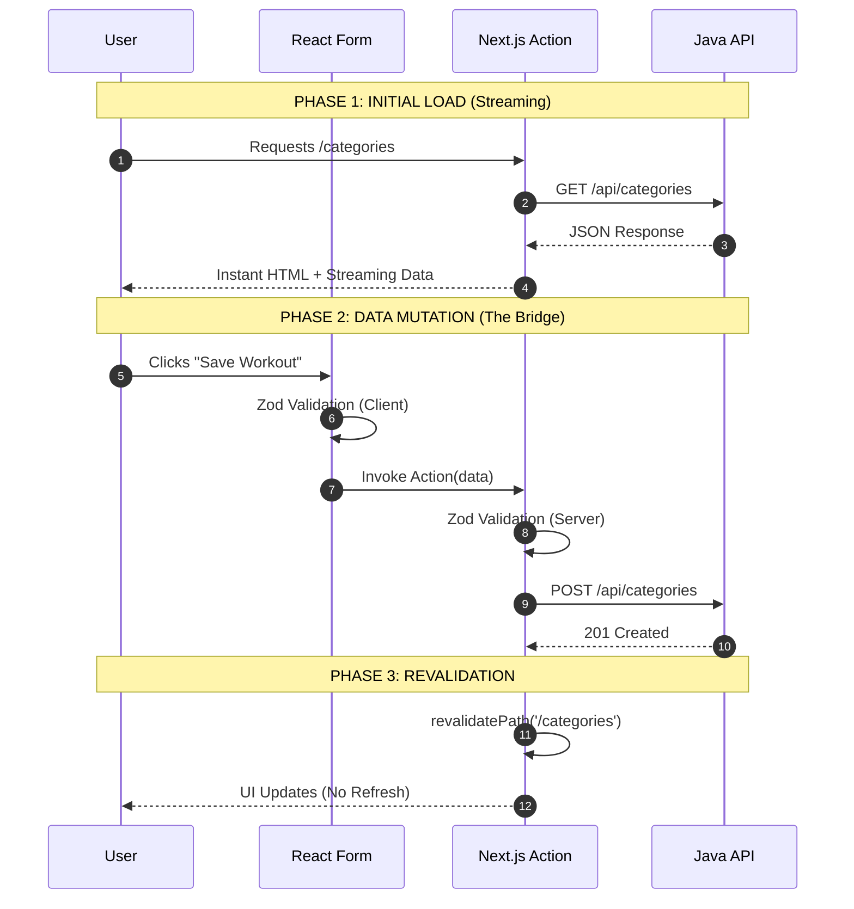

# Gym Tracker

##

GymTracker solves the friction of logging workouts by providing a high-performance, mobile-first interface. It moves beyond simple note-taking by categorizing movements and managing exercise libraries. Engineered with a **Next.js frontend** and a **Java Spring Boot** backend, this project demonstrates a bridge between modern React server patterns and enterprise-grade Java backend architecture.

---

## Technical Stack

### Frontend

- **Framework:** Next.js (App Router)
- **Styling:** Tailwind CSS + Shadcn/UI
- **Validation:** Zod (Type-safe schemas)
- **Deployment:** Vercel

### Backend

- **Framework:** Spring Boot
- **Database:** PostgreSQL (Hosted on Neon)
- **ORM:** Spring Data JPA (Hibernate)
- **Testing:** JUnit, Mockito, H2 In-memory DB
- **Deployment:** Render

### DevOps & Infrastructure

- **Containerization:** Docker & Dev Containers
- **CI/CD:** GitHub Actions (Automated Testing)

---

## Data Flow Diagram

---

## **Core Features**

- **Exercise Library:** Searchable database of exercises linked to specific categories with strict data integrity.
- **Server-Side Rendering (SSR):** Powered by Next.js for instant page loads and SEO-friendly exercise documentation.
- **Robust Architecture:** Uses Next.js Server Actions to securely communicate with a high-concurrency Spring Boot API.

###  DevOps & Infrastructure

- **Dev Containers:** Dockerized development environment for 100% setup consistency.
- **CI/CD Pipeline:** GitHub Actions runs the full test suite on every push.
- **Cloud Hosting:** Vercel (Frontend) + Render (Backend) + Neon (DB).

### Quality Assurance (Testing)

### **1\. Backend (JUnit & Mockito)**

- **Slices:** `@WebMvcTest` (API) and `@DataJpaTest` (DB).
- **Logic:** Mockito for services; Reflection for private field injection.

### **2\. Frontend (Vitest)**

- **Unit:** Component and Server Action validation.

### **3\. E2E (Playwright)**

- **Real-World:** Simulates full user journeys across Chromium, Firefox, and Safari.
- **Integrity:** Validates the connection between Vercel and Render.
